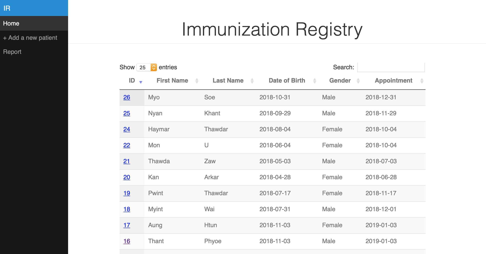

# Immunization Registry
This immunization registry is developed for CSE490c: Information and Communication Technology ofr Development (ICTD) class at the Paul G. Allen School.

## Background
In 2017, there were 60 people died from a measles outbreak in Naga Self-Administrative Zone in Myanmar. The two major challenges of immunization in Myanmar are the difficulty in conducting vaccination in hard-to-reach areas and vaccinating children of migrant families in urban areas as the families always move from place to place. Therefore, this application is designed to help keep track of the immunization record and the follow-up visit. 


## Immunization Registry UI

The application has four main pages
1. Home
2. Patient Information
3. Add a new Patient
4. Aggregate Report



## Installation
1. Create `.env` file and fill the configuration settings
2. Launch the app by running `npm start`

## Immunization Registry Backend
The backend of this app is Express server and MongoDB database. Below is the schema of the registry

```
{
  firstName: String,
  lastName: String,
  dateOfBirth: Date,
  gender: String,
  motherFirstName: String,
  motherLastName: String,
  contactInfo: String,
  immunization: [{
    date: Date,
    vaccine: String
    administered: Boolean
    clinicID: number
  },{
     …
  }],
  appointment: Date,
  createdDate: Date
}
```
The backend interacts with the frontend through the API below. 

| Method | Endpoint | Usage
|----|--|--|
|GET|/patients|Get patients data
|GET|/patients/:id|Get a patient data by their ID
|POST|/patients |Add a new patient
|POST| /patients/:id| Mark a patient’s immunizations as completed
